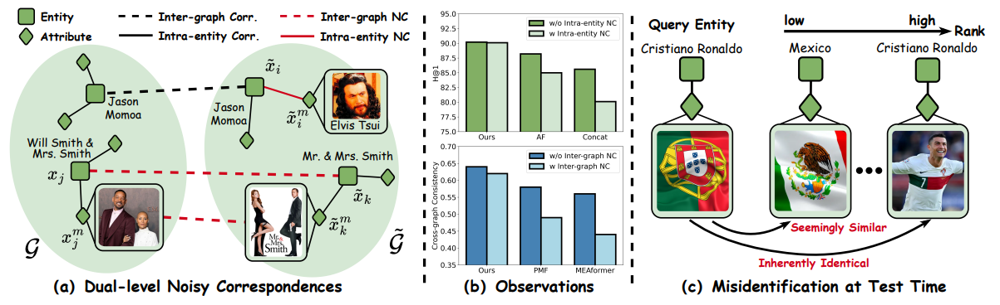
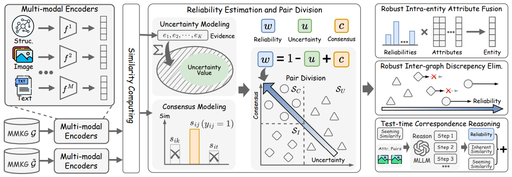

# Learning with Dual-level Noisy Correspondence for Multi-modal Entity Alignment

> Haobin Li, Yijie Lin, Peng Hu, Mouxing Yang, and Xi Peng, Learning with Dual-level Noisy Correspondence for Multi-modal Entity Alignment, ICLR 2026 (Oral). 👉 [[paper]](https://openreview.net/forum?id=mytIKuRsSE)

## 📖 Definition

Dual-level Noisy Correspondence (**DNC**) refers to misalignments in both intra-entity (entity-attribute) and inter-graph (entity-entity and attributeattribute) correspondences.

DNC would not only undermine the fusion of within-entity attributes but also misleading the inter-graph alignment, both of which significantly degrade the performance.



## 🚀 Contribution

- To achieve robust MMEA against the DNC problem, we propose a novel method termed RULE, which estimates the reliability of both the intra-entity and inter-graph correspondences with a dedicatedly-designed two-fold principle and accordingly mitigates the negative impact of DNC during the multi-modal attribute fusion and inter-graph alignment processes.
- During inference, RULE employs a novel correspondence reasoning module to uncover inherentlyidentical attributes and accordingly achieve more precise cross-graph equivalent entity identification. To the best of our knowledge, this could be one of the first methods to enhance test-time robustness for the MMEA task.
- We provide comprehensive benchmarks for evaluation on robustness against DNC. 



## 🛠️ Requirements & Installation

The environment setup for this project is based on the following two repositories. Please install the dependencies according to their respective instructions:

1. For Training: Refer to [PMF](https://github.com/ninibymilk/PMF-MMEA). 
2. For Test-time Reasoning: Refer to [Qwen2.5-VL](https://huggingface.co/collections/Qwen/qwen25-vl).

The hyper-parameters, the training options are defined in `config_ICEWS.py` and `config_DBP.py`.

## 📊 Datasets

The noise-injected ICEWS and DBP15K benchmarks used in this study can be downloaded from [[Baidu Clound]](https://pan.baidu.com/s/1RtgCGkm3jUu36u2mw6C9pg?pwd=abcd).

## 🖥️ Reproduce

Follow the steps below to reproduce the results for RULE. 

### 1. Robust Training 

To perform noise-robust training on the ICEWS dataset (e.g., with a 0.5 noise ratio):

```python
python main_ICEWS.py --noise_ratio 0.5
```

Note: You can adjust the `--noise_ratio` and other hyper-parameters in `config_ICEWS.py` or `config_DBP.py`.

### 2. Test-time Correspondence Reasoning (TTR)

The inference phase consists of a two-step "Retrieve-then-Reason" pipeline:

**Step A: Generate Prior Candidates** 

First, extract the initial alignment results and generate a candidate pool for reranking:

```python
python ./get_candidate/get_candidate_ICEWS.py
```

**Step B: MLLM-based Reasoning** 

Utilize the Multi-modal Large Language Model (Qwen2.5-VL) to perform fine-grained reasoning on attribute pairs to identify equivalent entities:

```python
python ./TTR/TTR_ICEWS.py
```

## 📝 Citation

If you find our work or the DNC benchmark useful, please consider citing our paper:

```latex
@inproceedings{li2025rule,
    title={Learning with Dual-level Noisy Correspondence for Multi-modal Entity Alignment},
    author={Haobin Li, Yijie Lin, Peng Hu, Mouxing Yang, Xi Peng},
    booktitle={International Conference on Learning Representations},
    year={2026}
    }
```
